<div align="center">
  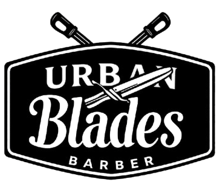
  <br><br>
  <p><strong>Sistema de gestión integral para barbería con reservas online, administración de empleados, servicios, clientes y generación de reportes</strong></p>

  
  
  
  
  
  
  
  
  
</div>

<br>

## Descripción

**Urban Blades Barber** es un sistema web full-stack diseñado para la gestión completa de una barbería. Permite a los clientes explorar servicios, registrarse con Google, y reservar citas online. El panel administrativo ofrece control total sobre empleados, servicios, clientes, reservas y reportes financieros con gráficos estadísticos.

### Funcionalidades principales

- **Landing page** con presentación de barberos, servicios y carrusel de comentarios
- **Reservas online** con selección de servicio, fecha y hora
- **Autenticación** con Google OAuth 2.0 (clientes) y login local (empleados)
- **Dashboard administrativo** con gráficos de reservas e ingresos
- **CRUD completo** de empleados, servicios, clientes y reservas
- **Gestión de horarios** con calendario interactivo (FullCalendar)
- **Generación de tickets** en PDF con Puppeteer
- **Consulta de DNI** desde la SUNAT/RENIEC
- **Panel por roles:** Administrador, Barbero y Recepcionista

---

## Capturas del proyecto

### Landing Page

<div style="display: flex; flex-wrap: wrap; justify-content: center; gap: 10px;">
  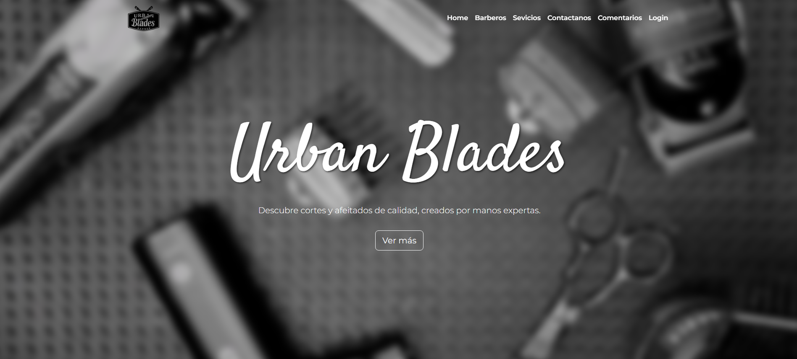
  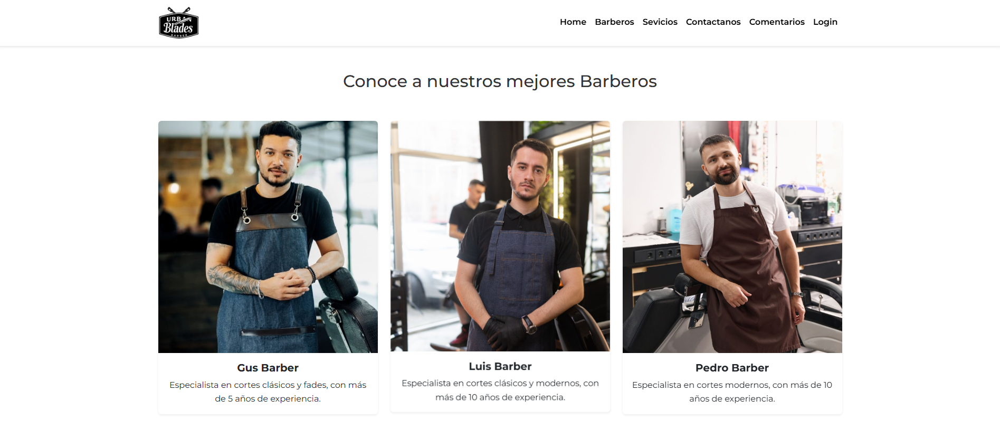
  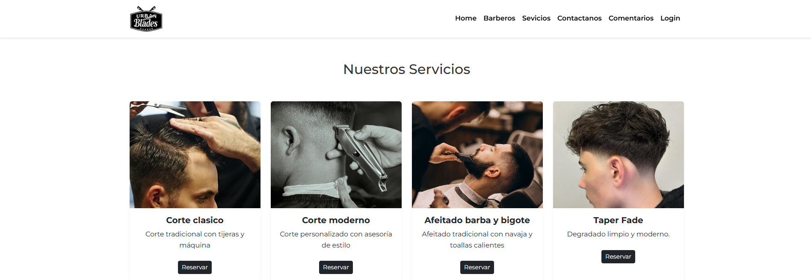
  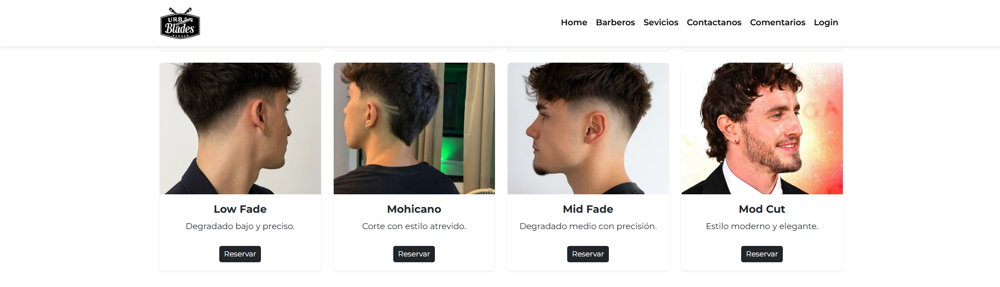
  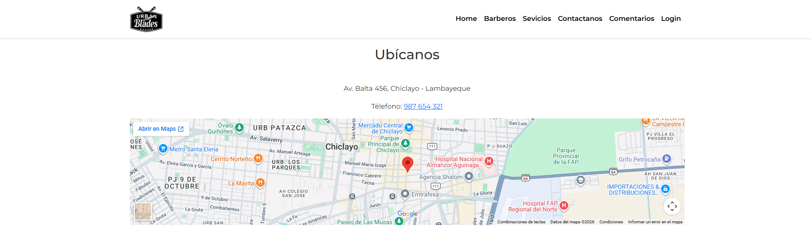
  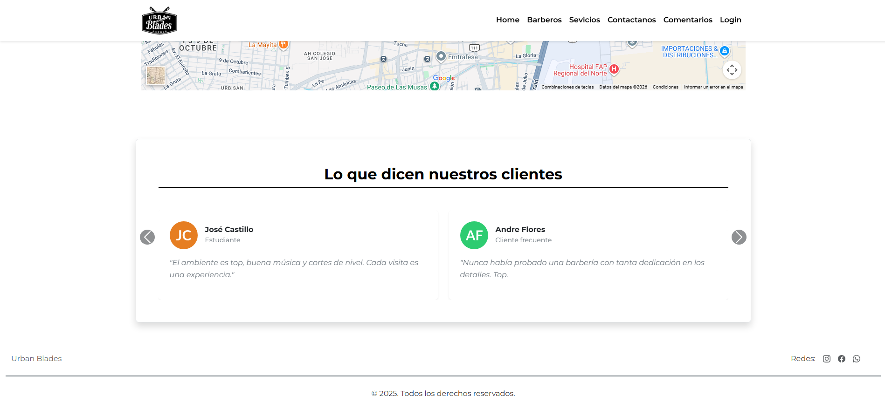
</div>

### Inicio de sesión

<div align="center">
  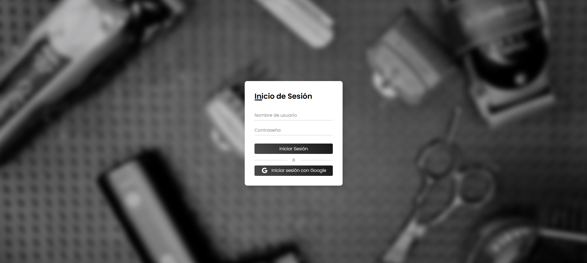
</div>

### Dashboard

<div align="center">
  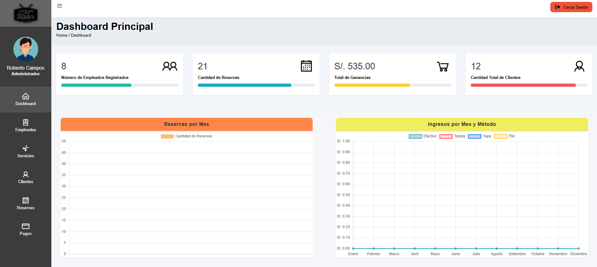
</div>

### Gestión de empleados

<div style="display: flex; flex-wrap: wrap; justify-content: center; gap: 10px;">
  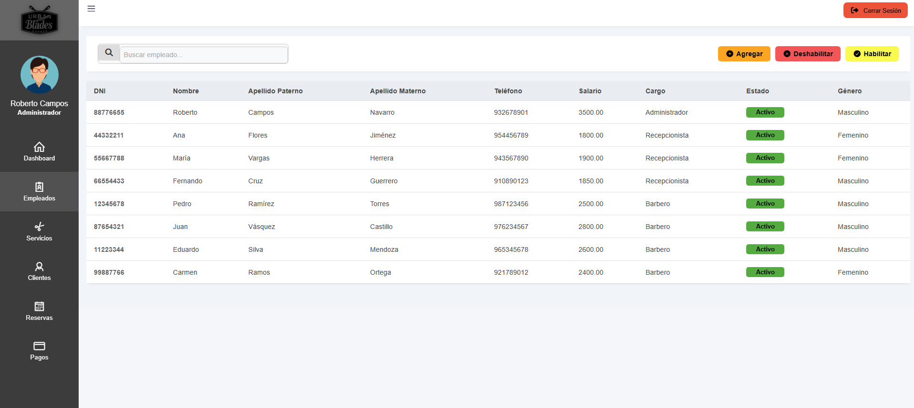
  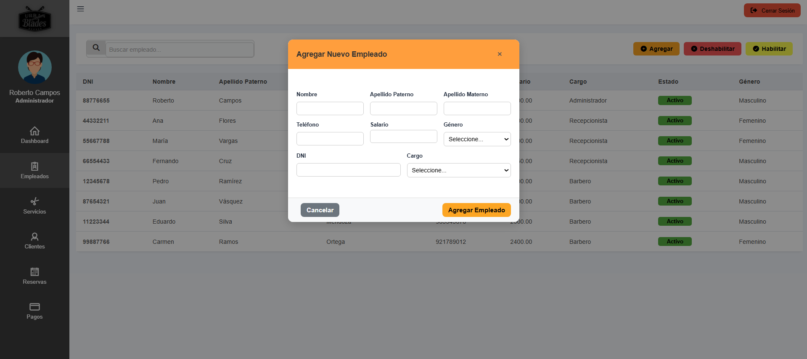
</div>

### Gestión de servicios

<div style="display: flex; flex-wrap: wrap; justify-content: center; gap: 10px;">
  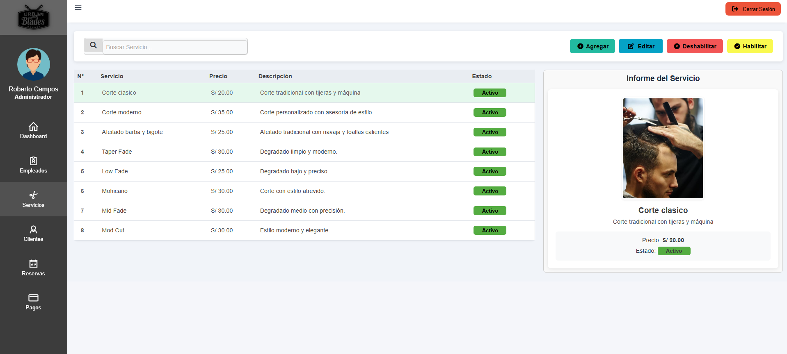
  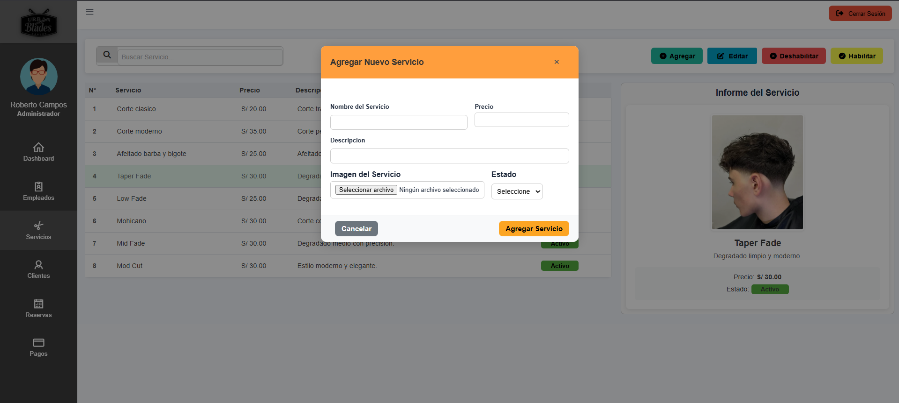
  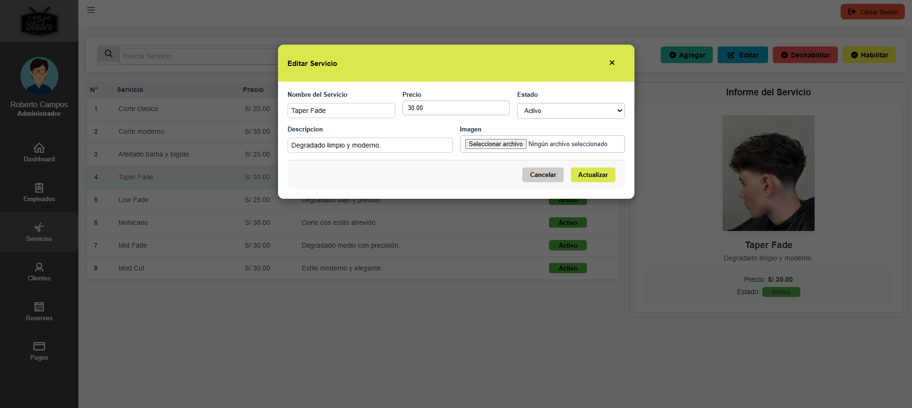
</div>

### Gestión de clientes

<div style="display: flex; flex-wrap: wrap; justify-content: center; gap: 10px;">
  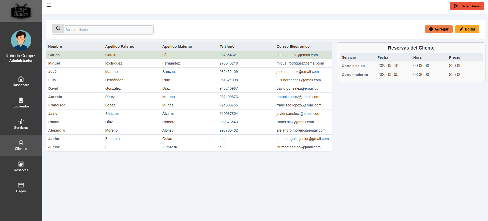
  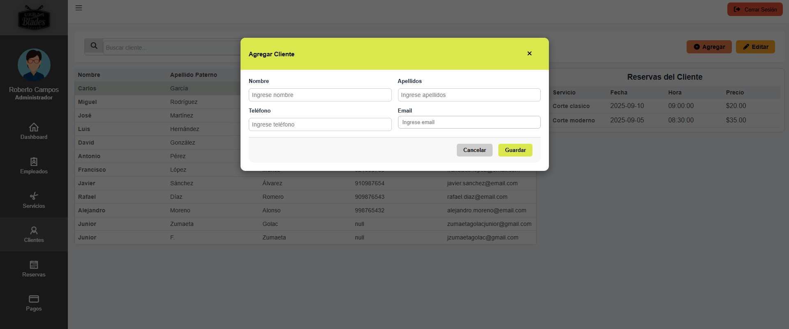
</div>

### Gestión de citas

<div style="display: flex; flex-wrap: wrap; justify-content: center; gap: 10px;">
  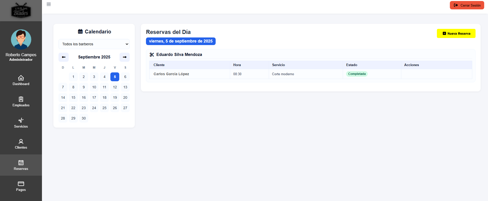
  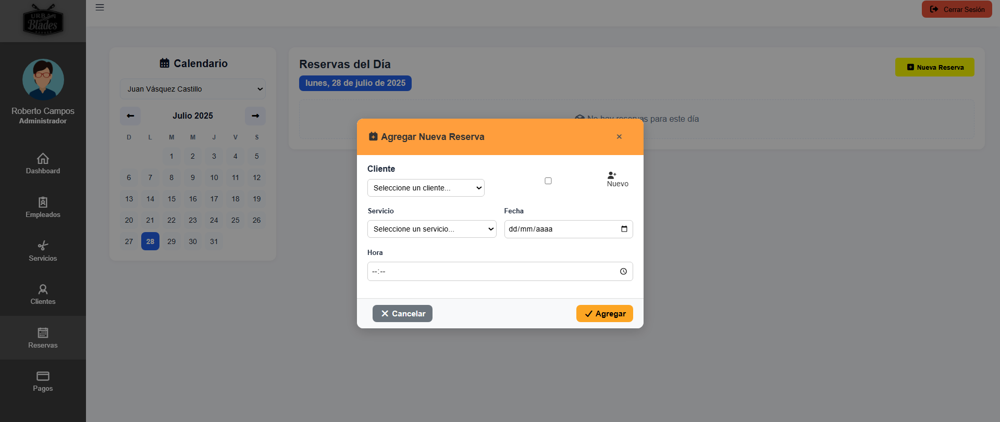
</div>

### Vista del barbero

<div align="center">
  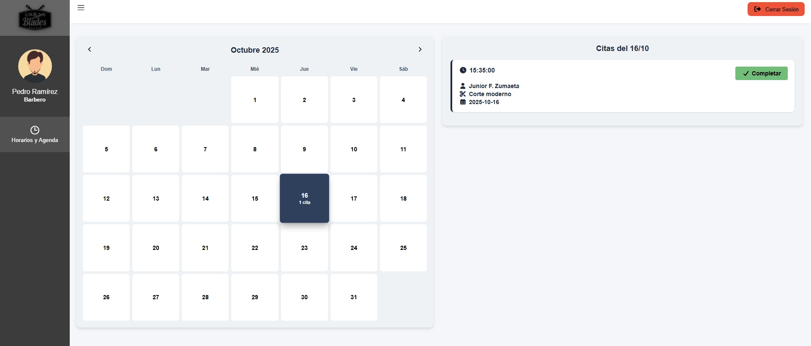
</div>

---

## Arquitectura del proyecto

```
UrbanBladesBarber/
├── index.html              # Landing page principal
├── scriptCreacion.sql      # Script de base de datos MySQL
│
├── api/                    # Microservicios Node.js (Express)
│   └── server/
│       ├── serverGoogle.js     # Autenticación Google OAuth (puerto 3000)
│       ├── serverDNI.js        # Consulta de DNI RENIEC (puerto 3001)
│       ├── serverTicket.js     # Generación de tickets PDF (puerto 3000)
│       └── credenciales.json   # Credenciales de Google OAuth
│
├── backEnd/                # Backend PHP (MVC)
│   ├── conexionBD_MySQL.php   # Conexión a MySQL
│   ├── controladores/         # Controladores (endpoints API)
│   ├── dao/                   # Data Access Objects
│   ├── modelos/               # Modelos de datos
│   └── servicios/             # Sesiones y login Google
│
├── frontEnd/               # Frontend
│   ├── css/                   # Estilos CSS
│   ├── html/                  # Páginas HTML
│   │   ├── login.html
│   │   ├── dashboard.html
│   │   └── dashboard2.html
│   └── js/                    # JavaScript
│       ├── scriptInicioSesion.js
│       ├── scriptValidacion.js
│       └── otrosScripts/
│
├── recursos/               # Recursos estáticos (imágenes)
└── capturas/               # Capturas de pantalla del proyecto
```


```
http://localhost:8000
```

## Stack tecnológico

| Tecnología | Propósito |
|---|---|
| **PHP** | Backend principal con arquitectura MVC |
| **MySQL** | Base de datos relacional |
| **Node.js + Express** | Microservicios (OAuth, DNI, PDF) |
| **HTML5 + CSS3 + JavaScript** | Frontend vanilla |
| **Bootstrap 5** | Framework CSS responsivo |
| **Chart.js** | Gráficos estadísticos en dashboard |
| **FullCalendar** | Calendario interactivo de reservas |
| **Puppeteer** | Generación de tickets PDF |
| **Passport.js** | Estrategia Google OAuth 2.0 |

---
